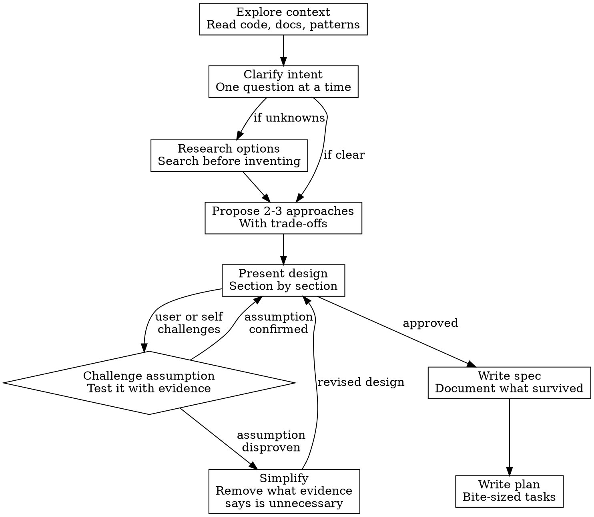

# Idea to Plan

## Overview

Turn vague ideas into minimal, validated specs and plans by **testing assumptions with evidence** at every step. The goal is convergence toward simplicity — start with the user's initial idea (often complex) and systematically challenge it until only what's necessary remains.

**Core principle:** One curl, one grep, or one file read can eliminate days of planned work. Test before you build.

## When to Use

- User has an idea but isn't sure about feasibility or approach
- A task sounds like it needs a new service, tool, or significant infrastructure
- The problem space is unclear and needs exploration before code
- User says "I don't know if it's possible" or "I want to validate"

**When NOT to use:** Task is already well-defined with a clear spec. User says "just build it."

## Process

## Step by Step

### 1. Explore context

Read the codebase, docs, configs, and existing patterns **before** proposing anything. Understand what already exists.

- Check for existing solutions to the same problem
- Read related env files, docker-compose, API routes
- Look at sibling projects for patterns to follow

### 2. Clarify intent

Ask **one question at a time**. Prefer multiple choice. Focus on:

- What problem are we solving, for whom?
- What does success look like?
- What constraints matter (tech stack, team skills, timeline)?

### 3. Research options (if needed)

If the problem has known solutions in the wild, search before inventing. Dispatch a research agent for broad exploration. Report findings as a comparison table with trade-offs.

### 4. Propose 2-3 approaches

Always present options with trade-offs and a recommendation. Let the user steer. Lead with your recommended option and explain why.

### 5. Present design section by section

Break the design into logical sections. Present one at a time. Get explicit approval ("does this look right?") before moving to the next.

**This is where the magic happens** — presenting incrementally invites challenges.

### 6. Challenge and simplify (the core loop)

At any point, when an assumption surfaces — **test it immediately.**

| Assumption | Test |
|-----------|------|
| "We need auth" | `curl` the endpoint without auth |
| "This service is internal-only" | Check the K8s ingress/nginx config |
| "We need a proxy for X" | Try calling X directly |
| "We need to build Y" | Search if Y already exists |
| "This data isn't accessible" | Query the DB or API |

**Rules for this loop:**

- If an assumption is disproven, simplify the design. Remove the component that assumption justified.
- If the user challenges something, investigate immediately. Don't defend complexity.
- Each cycle through this loop should make the solution simpler, never more complex.
- Be honest when a component turns out to be unnecessary — even if you just spent time designing it.

### 7. Write spec

Document what survived the simplification. Include:

- Problem statement
- Solution (what's needed)
- Architecture diagram
- What this enables
- Limitations (be honest)
- Developer setup (the actual workflow)
- Files to create/modify

Commit the spec. It's a decision record.

### 8. Write plan

Convert the spec into bite-sized implementation tasks with:

- Exact file paths
- Complete code in every step
- Exact commands with expected output
- Commit points after each task

## Red Flags

These thoughts mean you're skipping assumption testing:

| Thought | Do this instead |
|---------|----------------|
| "We'll probably need auth" | Test the endpoint now |
| "This should be a separate service" | Ask what it actually does — maybe it's 10 lines |
| "Let me design the full system first" | Present one section, get feedback |
| "The user asked for X so I'll build X" | Check if a simpler Y solves the same problem |
| "I already designed this part" | If evidence says remove it, remove it |

## What Makes This Work

1. **Evidence over assumption.** One `curl` killed a proxy, OAuth layer, and Docker service in our first use of this workflow.
2. **Incremental approval.** Section-by-section presentation gives the user natural challenge points.
3. **No sunk cost.** Willingness to throw away design work when evidence says it's unnecessary.
4. **Spec before plan.** The spec captures *what and why*. The plan captures *how*. They're separate documents with separate lifetimes.

